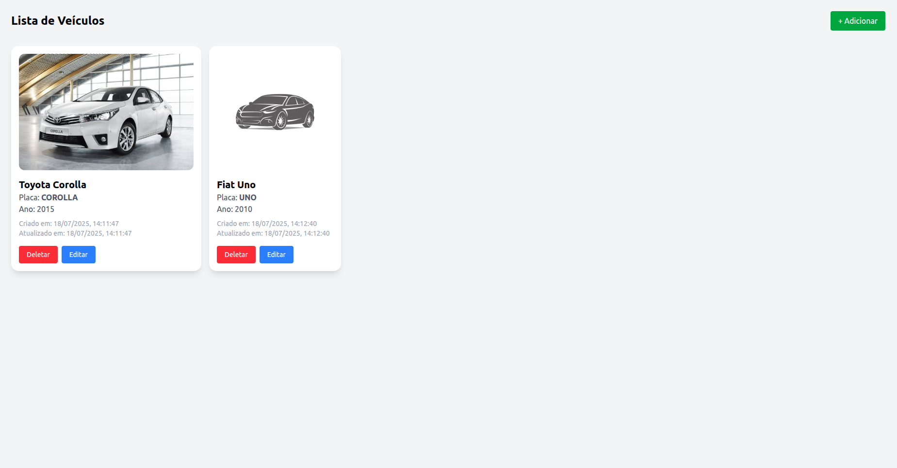
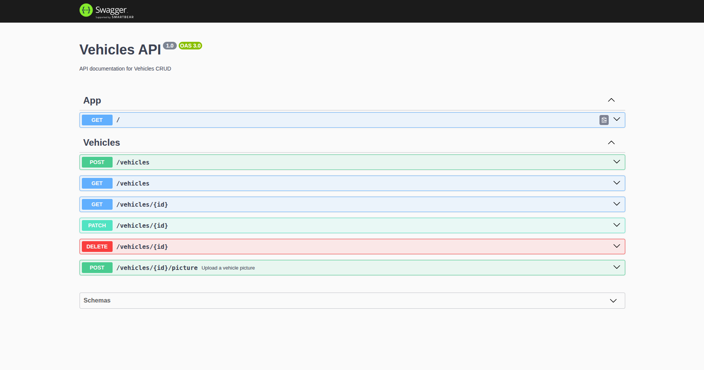

# Vehicles CRUD

CRUD para gerenciar veículos feito com Node.js, NestJS, TypeScript, MongoDB, Docker e React.



## Como rodar o projeto

### Serviços

Primeiramente é necessário ativar o **MongoDB** utilizando **Docker**, para isso basta rodar o comando `docker-compose up` na pasta raíz do projeto.

### Backend

```sh
cd backend
npm install
npm start
```

### Frontend

```sh
cd frontend
npm install
npm run dev
```

## Rotas da API

É possível ver as rotas disponíveis na API documentadas pelo Swagger, acessando http://localhost:3000/api


